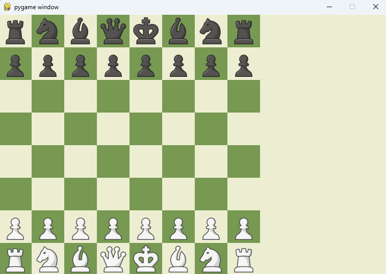
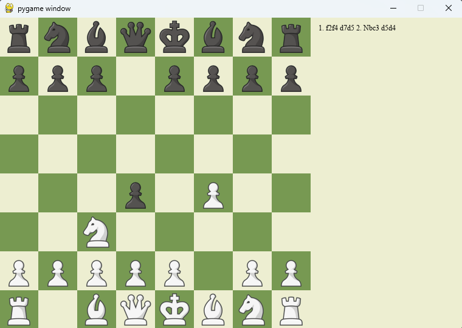
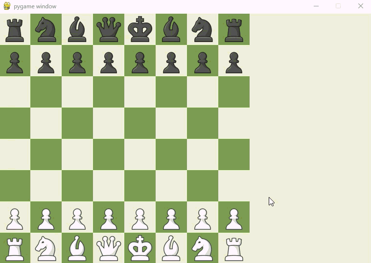

<div align="center"> 

# ♟️ PyGame Chess AI

A fully playable Python + Pygame chess game with human vs. human and human vs. AI modes, powered by Negamax with Alpha-Beta pruning, complete with castling, en passant, pawn promotion, undo and custom board themes.

<p align="center">


</p>

</div>

---

## 📖 Overview

**PyGame Chess AI** is a fully functional desktop chess game built from scratch in Python. It supports two modes: play against a friend on the same machine, or go head-to-head against an AI that uses the **Negamax algorithm with Alpha-Beta pruning** to think several moves ahead. All standard chess rules are implemented, including the trickier ones - en passant, pawn promotion, and castling. Custom board themes and immersive sound effects round out the experience.

---

## 🖼️ Screenshot

<p align="center">
  
  
</p>

> _The board mid-game - legal moves highlighted, AI thinking as Black_

---

## 🎥 Demo Video

<p align="center">
  
</p>

> _Full gameplay demo - Human vs. AI on Hard (Depth 4)_

---

## ✨ Features

- 🤖 **AI opponent** using Negamax + Alpha-Beta pruning with configurable search depth
- 👥 **Human vs. Human** mode: two players on the same device
- ♟️ **Full chess rule support**: legal move validation, check detection, checkmate & stalemate
- 🏰 **Castling**: both kingside and queenside
- 👣 **En passant**: special pawn capture correctly handled
- 👑 **Pawn promotion**: promote to Queen, Rook, Bishop, or Knight
- 🔦 **Move highlighting**: click a piece to see all legal squares lit up
- ⏪ **Undo**: press `Z` to take back the last move
- 🔄 **Reset**: press `R` to start a fresh game instantly
- 🎨 **Custom board themes**: multiple board color sets to choose from
- 🔊 **Sound effects**: distinct sounds for moves and captures
- ⚡ **Adjustable AI depth**: tune strength vs. speed to your preference

---

## 🛠️ Tech Stack

| Tool | Purpose |
|------|---------|
| `Python 3` | Core language |
| `pygame` | Game window, rendering, events, sound |
| `Negamax + Alpha-Beta` | AI move search algorithm |

---

## ⚙️ Requirements

- Python 3.7+
- `pygame`

Install with:
```bash
pip install -r requirements.txt
```

---

## 🚀 Getting Started

**1. Clone the repository**
```bash
git clone https://github.com/MusaIslamFahad/pygame-chess-ai.git
cd pygame-chess-ai
```

**2. Install dependencies**
```bash
pip install -r requirements.txt
```

**3. Run the game**
```bash
python chess/main.py
```

---

## 🕹️ Controls

| Action | Control |
|--------|---------|
| Select a piece | Left click |
| Move to a highlighted square | Left click |
| Undo last move | `Z` |
| Reset the board | `R` |

> **Tip:** While the AI is thinking, you can still click on its pieces to preview their possible moves.

---

## ⚙️ Configuration

All settings live in just two files - no config file needed.

### Switch Game Mode (`chess/main.py`)

```python
# Human vs Human
SET_WHITE_AS_BOT = False
SET_BLACK_AS_BOT = False

# Human vs AI  (you play White, AI plays Black)
SET_WHITE_AS_BOT = False
SET_BLACK_AS_BOT = True

# AI vs AI
SET_WHITE_AS_BOT = True
SET_BLACK_AS_BOT = True
```

### Flip Board: Play as Black (`chess/engine.py`)

```python
self.playerWantsToPlayAsBlack = True   # Set True to flip the board
```

### AI Search Depth (`chess/chessAi.py`)

```python
DEPTH = 3   # Recommended range: 2–4
```

| Depth | Strength | Speed |
|-------|----------|-------|
| 2 | Beginner | Very fast |
| 3 | Intermediate | Fast |
| 4 | Strong | Moderate |
| 5+ | Very strong | Slow |

> ⚡ Depth 3–4 gives the best balance of challenge and response time.

---

## 🧠 How the AI Works

The AI uses **Negamax with Alpha-Beta pruning**, a standard technique in chess engine development:

1. **Negamax**: a simplified form of Minimax that treats the problem symmetrically: both players try to maximize their own score, so the current player's best move is always the one that minimizes the opponent's best response
2. **Alpha-Beta pruning**: cuts off branches of the search tree that can't possibly affect the final decision, allowing the engine to search deeper in the same time
3. **Position evaluation**: scores each board state using piece values and positional bonuses (piece-square tables)

The result: an AI that plans several moves ahead and never makes purely random choices.

---

## ♟️ Special Rules Explained

### Castling
The king moves two squares toward a rook on its first move, and the rook jumps to the other side. Available kingside and queenside, as long as neither piece has moved and the king is not in or passing through check.

### En Passant
When a pawn advances two squares from its starting position, an adjacent enemy pawn may capture it as if it had moved only one square. But only on the very next move.

### Pawn Promotion
When a pawn reaches the far rank (rank 8 for White, rank 1 for Black), it is immediately promoted. Choose from Queen, Rook, Bishop, or Knight.

---

## 📂 Project Structure

```
pygame-chess-ai/
│
├── chess/
│   ├── main.py          # Entry point — game loop, mode config
│   ├── engine.py        # Board state, move generation, game rules
│   └── chessAi.py       # Negamax + Alpha-Beta AI logic
│
├── images/              # Primary piece image set
├── images1/             # Alternate piece image set
├── sounds/              # Move and capture audio files
├── screenshots/         # README screenshots (add your own)
├── requirements.txt     # Python dependencies
└── README.md
```

---

## 🔮 Future Enhancements

- 🌐 **Online multiplayer**: play against friends over the network
- 📜 **Move history panel**: display the full game in algebraic notation
- ⏱️ **Chess clock**: add time controls for blitz and rapid formats
- 💾 **Save & load games**: resume a match from a saved position (FEN/PGN support)
- 📊 **Evaluation bar**: live visual indicator of who's winning
- 🔢 **Opening book**: pre-loaded openings for more human-like early play

---

## 🤝 Contributing

Contributions are welcome! To get started:

1. Fork the repository
2. Create a feature branch (`git checkout -b feature/your-feature`)
3. Commit your changes (`git commit -m 'Add your feature'`)
4. Push to the branch (`git push origin feature/your-feature`)
5. Open a Pull Request

Please open an issue first for major changes so we can discuss the approach.

---

## 🙏 Acknowledgments

- [Pygame](https://www.pygame.org/) - for making GUI game development in Python simple and fun
- Classic chess engine literature for Negamax and Alpha-Beta pruning theory

---

## 👨‍💻 Author

**Musa Islam Fahad**
- GitHub: [@MusaIslamFahad](https://github.com/MusaIslamFahad)

---

> ⭐ If you enjoyed the project or learned something from it, Drop a star. It means a lot!
